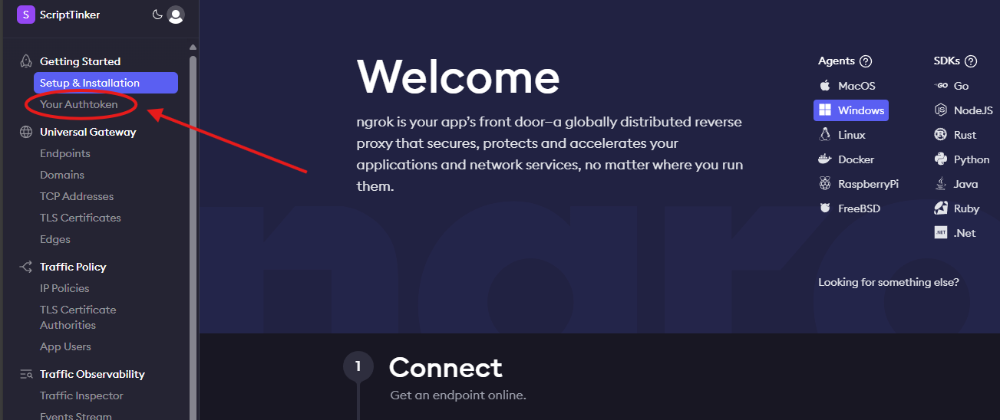
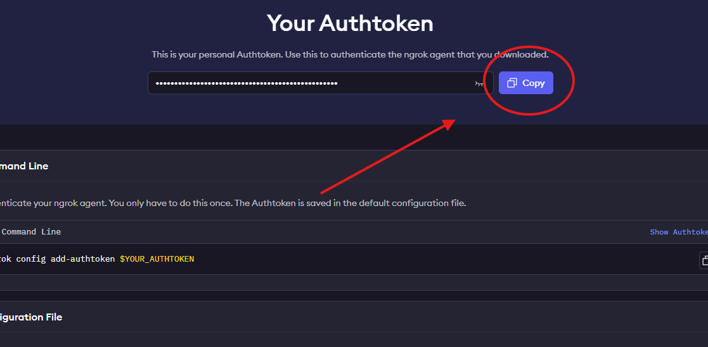
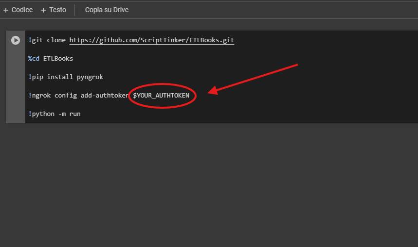
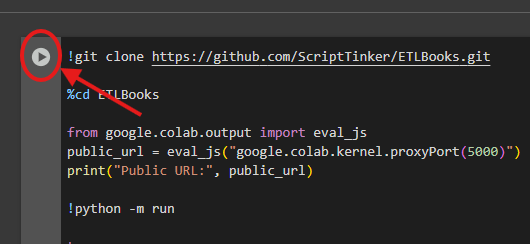
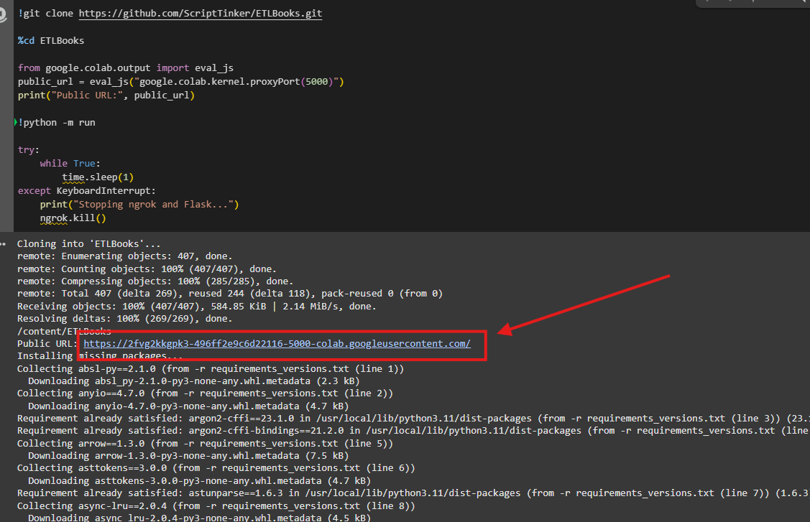

A simple app that scraps books off the site: "https://books.toscrape.com/" and displays them in a flask app with the option to view particular graphs(powered by Dash/Plotly) such as "The avarage price per category" for research purposes with an AI commentary beside the graph(powered by the Hugging Face "Zephyr 7b beta" pre-train model)

This projects requires a Nvidia GPU to run! However here's a way to test it without any sort of heavy hardware:

# Google Colab

Here's a guide on how to use google colab:

## 1. Create a ngrok account at the following link:

https://dashboard.ngrok.com/login

## 2. Once you created you account go to the "Your Authtoken tab and copy your ngrok token:

## 3. Click on the link below

## 4. Replace "$YOUR_AUTHTOKEN" with your actual token:

## 5. Click on the arrow with white background close to the code cell:

## 6. Once the runtime has been initilized click on the blue link that lets you visualize the web app:

   
   The link may differ from this example...
   
## 7. Wait until the AI model is downloaded! Once the process is complete avoid the local links, that's for local instance only!
   You may need to refresh the page if you click on the link early on...
